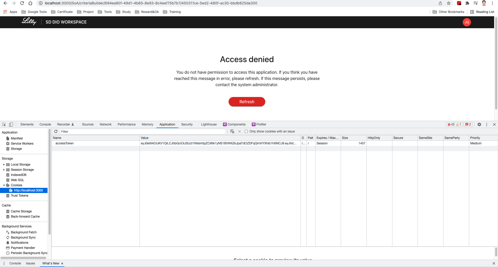
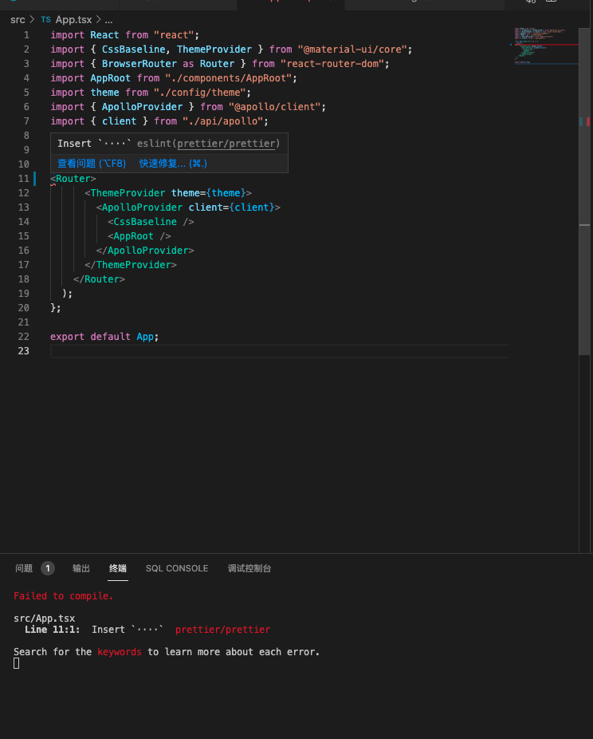

# dhai_sddio_ui

## Development tips:

1. check environments, make sure you have installed node.js 14.0+
2. run `npm install` or `yarn` to install the dependencies.
3. create a .env file in the root level and define the variable `REACT_APP_URI` with the value of backend URL.
4. run `npm start` to run the app in local.
5. you may need to replace the accessToken in the browser, you can get this token from dev environment's Cookie.:

### eslint error
After your compile, if you meet error like this: 

please refer to: [Fix Eslint Error](public/readme/fixEslintError.md)

## How to run Cypress tests using Cypress CLI:

1.To run all the test cases from your Workspace on the Command-Line or terminal, instead of "cypress open", we just have to mention "cypress run" We can use the below command to run all the spec files present under the Integration folder.
