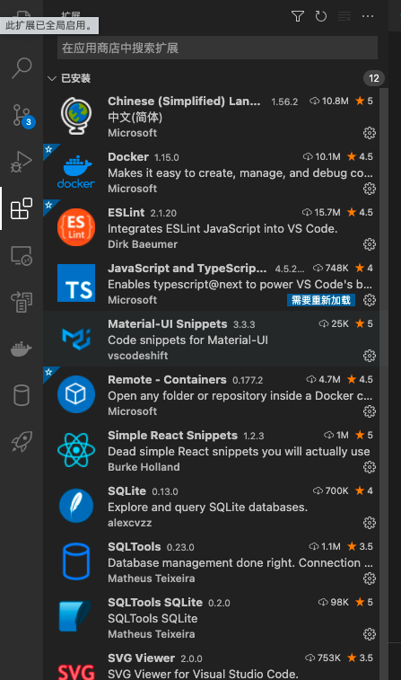
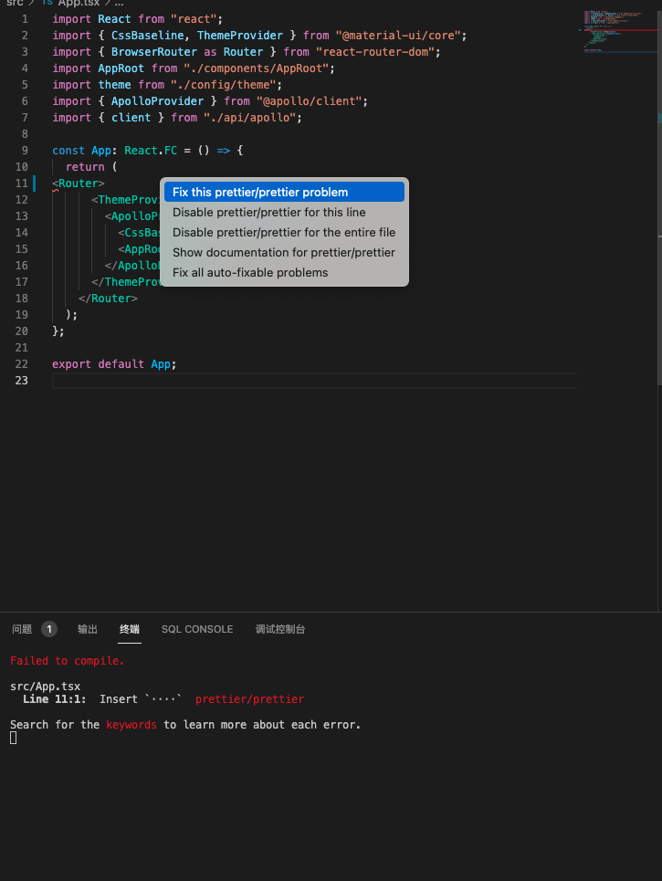
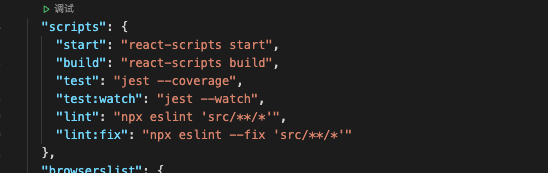

## fix EslintError

To fix eslint error, first you should install the eslint plugin.



There are 2 ways to fix errors like this:
1. Move your mouse to the red line, and you will see the tooltips, then click quick fix, and select Fix this prettier/prettier problem, and it will automaticlly fix this problem for you.



2. If you do not have eslint plugin or you have may errors, you can use command: <br> ```javascript yarn run lint:fix```<br>to fix all the errors. this command has defined in `pakage.json`:<br><br>


## Compile error: 'Line 0: Parsing error: Cannot read property 'map' of undefined'

***Reference: [Stack Overflow: Line 0: Parsing error: Cannot read property 'map' of undefined](https://stackoverflow.com/questions/62079477/line-0-parsing-error-cannot-read-property-map-of-undefined)***

When you use Typescript and you defined a array type like this:
```
interface State{
    foo: []
}
```
It may cause compile error: 
```
Line 0: Parsing error: Cannot read property 'map' of undefined
```

There are 2 solutions to resolve this problem:
1. Update your ```react-scripts``` to 4.0 above.
2. Change your code to :
```javascript
interface State{
    foo: any[]
}
```


