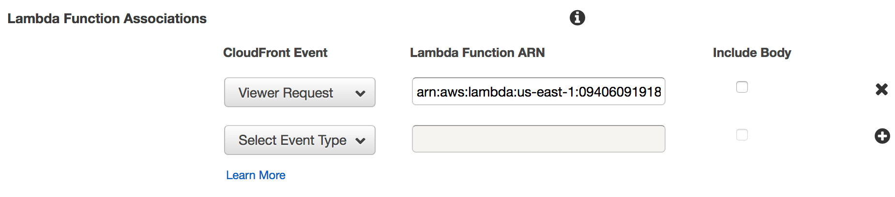

# AWS Lambda Authenticator - Lambda@Edge 

> AWS Lambda@Edge function for authenticating CloudFront requests

This Lambda@Edge function validates HTTP requests for a web session established via OpenID Connect (OIDC) SSO. If the appropriate cookie is found then the JWT it contains is validated against Lilly production Azure AD.
The audience is also validated, if provided. If the cookie is not present then users are redirected to the Azure AD for SSO.

*This function reserves the `/_callback` path for its own use. Applications making use of this function should not attempt to use that path.*

## Install

You will need [Node.js](https://nodejs.org/en/) v12 installed to ensure compatibility with AWS Lambda. [NVM](https://github.com/creationix/nvm)
is recommended if you need multiple versions of Node. For local development you should, ideally, have Docker and the
[AWS SAM CLI](https://github.com/awslabs/aws-sam-cli) installed. This will enable you to test any changes locally.

To install dependencies run the command below while in the same directory as this README.md file.

```bash
npm install
```

If deploying this lambda function the devDependencies should not be installed. To do this you can use the following command.

```bash
npm install --only=prod
```

## Running Unit Tests

```bash
# Install testing dependencies
npm install
# Run tests
npm test
```

## Linting

```bash
# Install linting dependencies
npm install
# Run eslint
npm run lint
```

## App Registration

You will need to submit a request to Lilly Federation Services to register your app in Azure AD for OpenID Connect.  See [these instructions](https://github.com/EliLillyCo/CIRR_OIDC_AUTH_MODULE#federation-connection) for submitting this request.  You should specify your callback URL as `https://*CLOUDFRONT HOST*/_callback`. You can provide multiple callback URLs, if needed.

## AWS Systems Manager Parameter Store Values

These values should all be namespaced to the AWS CloudFront Distribution ID that will be making use of the function.
For the following examples `ABCDEFGHIJKLM` is used as an example ID, it should be replaced with the actual value for your
CloudFront Distribution. By default these parameters *MUST* be set in the us-east-1 region. You can change this in the
`lib/parameterStore.js` file near the top. You will also need to ensure the Lambda Function's execution role has access
to the parameters in the new region, as shown in template.yaml.

- `/ABCDEFGHIJKLM/oidc-client-id`: **REQUIRED** Client ID for the application
- `/ABCDEFGHIJKLM/oidc-client-secret`: **REQUIRED** Client Secret for the application
- `/ABCDEFGHIJKLM/oidc-oauth-scope`: The scopes that should be used when initiating the OIDC SSO flow. Defaults to `openid`. See the federation request instructions above for other possible scopes.
- `/ABCDEFGHIJKLM/expected-audience`: **RECOMMENDED** `aud` (audience) or `azp` (client ID) attribute values that are considered valid in the JWT payload. It is recommended that you assign your Azure AD app (client) ID(s) as the parameter value. Separate multiple values with a comma.

## Local Testing

If you have the [AWS SAM CLI](https://github.com/awslabs/aws-sam-cli) and Docker installed you can execute the Lambda
functions locally for testing purposes.

You can run the command below to see details on how to invoke a function locally.

```bash
sam local invoke --help
```

The function expects to be used as a Viewer Request Lambda@Edge for a CloudFront distribution.
An example event that could be used for testing is shown below (the JWT will not validate).

Other examples are available in the [`tests/events.js`](tests/events.js) file.

```json
{
  "Records": [
    {
      "cf": {
        "config": {
          "distributionDomainName": "d1l1caev0ejgt7.cloudfront.net",
          "distributionId": "ABCDEFGHIJKLM",
          "eventType": "viewer-request",
          "requestId": "Y03GWMYB5f-JgfGpAE5Pcyuw4apqKD4YP0mAPsheTBULwciVswK22w=="
        },
        "request": {
          "clientIp": "40.248.248.14",
          "headers": {
            "host": [
              {
                "key": "Host",
                "value": "d1l1caev0ejgt7.cloudfront.net"
              }
            ],
            "cookie": [
              {
                "key": "Cookie",
                "value": "accessToken=test-access-token"
              }
            ]
          },
          "method": "GET",
          "querystring": "",
          "uri": "/"
        }
      }
    }
  ]
}
```

## AWS Configuration (Manual)

This function is intended to be used as a viewer request Lambda@Edge. In a CloudFront Distribution go to the *Behaviors* tab. Edit the appropriate item, most likely the only item.
At the bottom under *Lambda Function Associations* set the *CloudFront Event* to *Viewer Request*. Then set the *Lambda Function ARN* to the ARN for the Lambda Function's version that you wish to use.
This field does not accept aliases, it must be a specific version.


